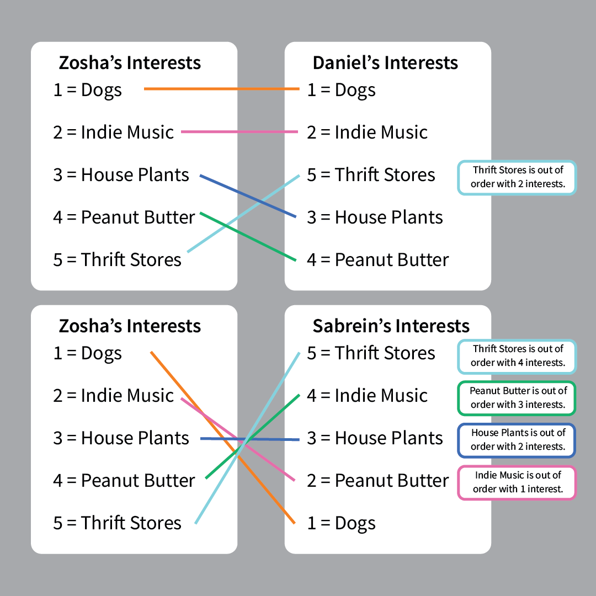

# Project 2: Hybrid Sorting
**Due: Thursday, October 8th @ 8:00pm EST**

*This is not a team project, do not copy someone else’s work.*
## Introduction

A **sorting algorithm** is an algorithm that puts elements in a certain order. This is commonly seen when we need to
organize an array or list in numerical or lexicographical order. 

There are various sorting algorithms - each with their own benefits in terms of efficiency. This project will be 
focussing on the *Insertion Sort Algorithm* and the *Merge Sort Algorithm*. 

####Insertion Sort

Insertion sort is an in place comparison based sorting algorithm. It builds a final sorted array by comparing one
element at a time and inserting it into it's appropriate location. 

The worst case runtime is O(n^2).
The best case runtime is O(n) - in the case that the array is already sorted. 
The space complexity is O(1) for in place implementation.

####Merge Sort

Merge sort is one of the most efficient sorting algorithms. It works on the principle of Divide and Conquer. 
Merge sort repeatedly breaks down a list into several sublists until each sublist consists of a single element and 
merging those sublists in a manner that results into a sorted list.

The worst case runtime is O(nlog(n)).
The best case runtime is O(nlog(n)). 
The space complexity is O(N) - as new arrays are created everytime you divide.

####Hybrid Sort

While Merge Sort has a faster average runtime than Insertion Sort, there are instances that an Insertion Sort is more 
efficient. Due to the overhead of recursively splitting containers with a Merge Sort, Insertion Sort can have a faster 
performance with small sets of data.

## Project Details
### Overview
You will be implementing the Insertion Sort Algorithm and the Merge Sort Algorithm. You will develop your Merge Sort 
such that it can be used as a Hybrid Sort when given a threshold value. The Hybrid Sort will rely on Merge Sort until 
the partitioned lists are less than or equal to a given threshold, at which point you will switch to Insertion Sort.

In addition to these sorting algorithms, you will be implementing an algorithm to determine the *inversion count* of 
a list of elements. This algorithm will be integrated into your merge_sort function. You will only calculate the inversion 
count when your function is not being used as a Hybrid Sort, that is, the threshold is 0.

The inversion count is how far away a list of elements is from being sorted. The inversion count of a sorted array is 0.
You can think of the number of inversions as the number of pairs of elements that are out of order.

Two elements a[i] and a[j] form an inversion if a[i] > a[j] and i < j

##### Examples:

**data = [3,2,9,0]**
- data has 4 inversions:
   - (3, 2): 3 > 2 but 3 comes before 2
   - (3, 0): 3 > 0 but 3 comes before 0
   - (2, 0): 2 > 0 but 2 comes before 0
   - (9, 0): 9 > 0 but 9 comes before 0
    

**data = [1, 2, 3, 4, 5]**
- data has 0 inversions

Note: Although you can swap the elements of the inversions to form a sorted array, the inversion count is not the same 
as the minimum number of swaps to sort the array.

For instance, data = [10, 1, 2, 0]. 

You could sort this in 1 *swap* (10, 0), but there are 5 *inversions* (10, 1), (10, 2), (10, 0), (1, 0), (2, 0).

### Assignment Specs
You are given one file, HybridSort.py. You must complete and implement the following functions. 
Take note of the specified return values and input parameters. *Do not change the function signatures*.

You must adhere to the required time & space complexities.

**HybridSort.py:**

- **insertion_sort(data)**
    - Given a list of values, perform an insertion sort to sort the list.
    - data: List of str or int to be sorted.
    - return: None
    - Time Complexity: O(n^2)
    - Space Complexity: O(1)
    
- **merge_sort(data, threshold = 0)**
    - Given a list of values, perform a merge sort to sort the list and calculate the inversion count. When a threshold 
    is provided, use a merge sort algorithm until the partitioned lists are smaller than or equal to the threshold - 
    then use insertion sort.
    - data: List of str or int to be sorted.
    - threshold: int representing the size of the data at which insertion sort should be used. Defaults to 0.
    - return: int representing inversion count. 0 if threshold > 0.
    - **NOTE**: The inversion count will be calculated when only a merge_sort algorithm is used! (when threshold is 0) 
    return 0 otherwise.
    - **NOTE**: This must be done recursively
    - Time Complexity: O(n*log(n))
    - Space Complexity: O(n)
    
- **hybrid_sort(data, threshold)**
    - Wrapper function to use merge_sort() as a Hybrid Sorting Algorithm. Should call merge_sort() with provided 
    threshold.
    - data: List of str or int to be sorted.
    - threshold: int representing the size of the data at which insertion sort should be used.
    - return: None
    - Time Complexity: O(n*log(n))
    - Space Complexity: O(n)
   
- **inversion_count(data)**
    - Wrapper function to use merge_sort() to retrieve the inversion count. Should call merge_sort() with *no threshold.*
    - data: List of str or int to be sorted.
    - return: int representing inversion count.
    - Time Complexity: O(n*log(n))
    - Space Complexity: O(n)
    
####Application

You will be designing a simple recommendation engine for SELF.FIND(LOVE), a popular dating app for programmers. 

Given a user's ranking of interests, and the candidate interest rankings, you will need to find the candidate 
who most closely relates to them, that is, their rankings are **closest to being in the same order** of the user's.

#####Examples
Suppose the Zosha has ranked their interests in this order: 

1. Dogs
2. Indie Music
3. House Plants
4. Peanut Butter
5. Thrift Stores

These are the potential candidates and their ranking of these interests:
- Daniel
    - [Dogs, Indie Music, Thrift Stores, House Plants, Peanut Butter]
- Sabrein
    - [Thrift Stores, Peanut Butter, House Plants, Indie Music, Dogs]
    
Here is how the candidates compare to Zosha:

Daniel would be their ideal match because they have the *least number of interests in a different order* than Zosha.

Sabrein has 10 interests out of order where Daniel has 2.

- **find_match(user_interests, candidate_interests)**
    - Given a list of user interests, ranked in order of preference, and a mapping of candidates to their interest
    rankings, return the name of the candidate whose interest ranking most closely match the user's.
    - user_interests: List of interests in order of preference ranking.
    - candidate_interests: Dictionary where keys are candidate names (str), and values are corresponding interest 
    rankings (List(str)).
    - return: Name of candidate match
    - **Note**: if multiple candidates match the user, return the one that came first in the dictionary.
    - **Note**: You must use inversion_count
    - **Note**: Candidates are guaranteed to have interest lists with the same interests as the user, but different
     ordering. 
    - Time Complexity: O(k\*n\*log(n))
    - Space Complexity: O(k*n)

## Submission

#### Deliverables
Be sure to upload the following deliverables in a .zip folder to Mimir by 8:00p Eastern Time on Thursday, 10/08/20.

Your .zip folder can contain other files (for example, description.md and tests.py), but must include (at least) the 
following:

    |- Project2.zip
        |— Project2/
            |— README.md        (for coding challenge feedback)
            |— __init__.py      (for proper Mimir testcase loading)       
            |— HybridSort.py     (contains your solution source code)
            
#### Grading
The following 100-point rubric will be used to determine your grade on Project2:

- Tests (80)
    - 00 - Coding Standard:     __/2
    - 01 - Insertion Sort:      __/5
    - 02 - Insertion Sort (H):  __/6
    - 03 - Merge Sort:          __/5
    - 04 - Merge Sort (H):      __/6
    - 05 - Hybrid Sort:         __/3
    - 06 - Hybrid Sort (H):     __/3
    - 07 - Inversion Count:     __/5
    - 08 - Inversion Count (H): __/8
    - 09 - Application:         __/7
    - 10 - Application (H):     __/15
    - 11 - Comprehensive (H):   __/15
- Manual (20)
    - Insertion Sort Complexities:  __/4
    - Merge Sort Complexities:      __/4
    - Hybrid Sort Complexities:     __/1
    - Inversion Count Complexities: __/1
    - Application Complexities:     __/8
    - README.md is completely filled out with (1) Name, (2) Feedback, (3) Time to Completion and (4) Citations: __/2

## Tips, Tricks & Notes

- ***You must fill out function doc strings to receive Coding Standard points.***
- As of Python 3.6, Dict items are in order of insertion.
- You may not use any additional data structures other than lists.
- You may use a Dictionary in the Application problem, but *only the Application*. 
- **You may not use Python's built in sort, or any imported sorting methods.**
- Test cases will only test the functions specified.
    - Note: The Merge Sort Test Cases will not test for inversion count or with a threshold.
- Try these web applications to visualize sorting algorithms:
    - https://visualgo.net/bn/sorting  (includes inversion count - "inversion index")
    - https://opendsa-server.cs.vt.edu/embed/mergesortAV (good merge sort visualization)
    - https://www.cs.usfca.edu/~galles/visualization/ComparisonSort.html
- The file `plot.py` has been provided for comparing your sorting function's runtime. 
    - Run this file to see a graphical representation of your functions' performances.
    - You may need to install matplotlib and numpy.
        - If you are not familiar with the terminal instructions are here: 
        https://www.jetbrains.com/help/pycharm/installing-uninstalling-and-upgrading-packages.html
        - Otherwise use these commands:
            - pip install matplotlib
            - pip install numpy
    - You do not have to use this.
    

*This project was created by Zosha Korzecke & Olivia Mikola*
