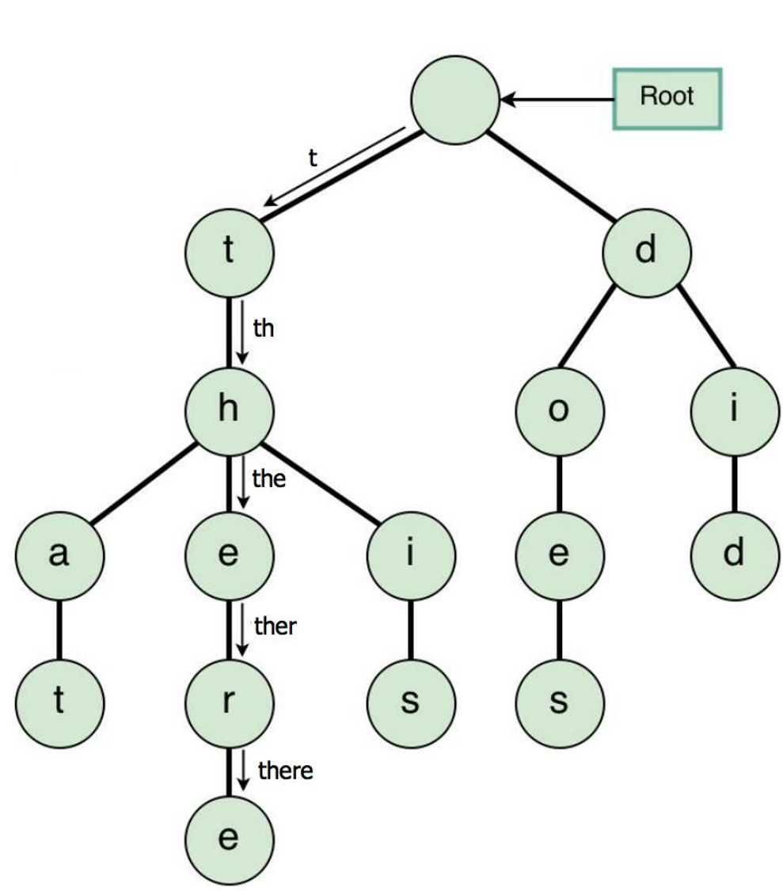
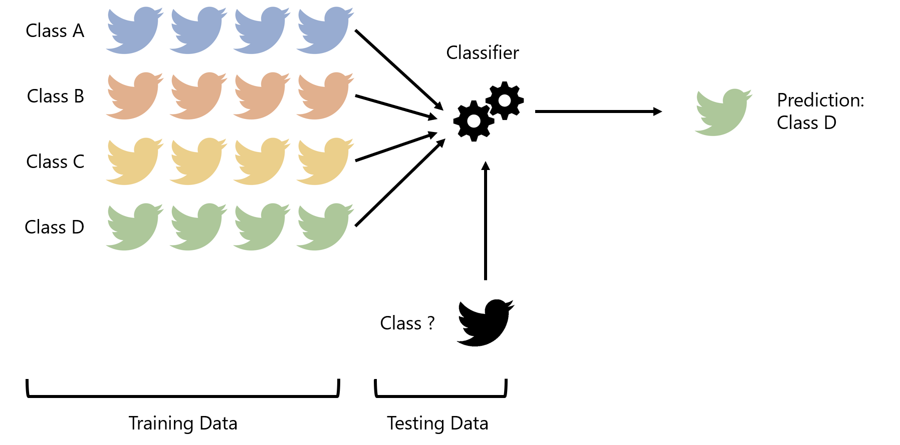

# Project 4: Tries

**Due: Thursday, October 22nd @ 8:00pm**

*This is not a team project, do not copy someone else’s work.*

## Assignment Overview

[Tries](https://en.wikipedia.org/wiki/Trie) —also known as prefix trees—are
[m-ary trees](https://en.wikipedia.org/wiki/M-ary_tree) designed
to support fast insertion, lookup and deletion on strings and other data that may be stored sequentially.
In a sense, they combine the advantages of a dictionary/hashtable with those of a tree. Like dictionaries,
they support near-constant-time insertion, lookup and deletion—like trees, they may be stored efficiently
in non-contiguous blocks of memory and encode a large amount of information in limited space.

Tries consist of a *root node* with up to *m* child nodes, where each child node is either a leaf or the root
of a subtrie. When used to store a vocabulary of English strings, we take *m=26* and create 26 child nodes, each labeled
with a letter a-z. To insert a string into our trie, we begin at the root node and go to its child labeled with the
first letter in our word—then, from this second node, we go to its child labeled with the second letter
in the word... and so on, until we reach the end of the string. At each step, we create children with the proper
letter labels if they do not already exist. Lookups and deletions work similarly.

For a neat video introducing tries, follow [this link](https://youtu.be/zIjfhVPRZCg)!

The history of tries can be traced back to a [1959 paper](https://pdfs.semanticscholar.org/3ce3/f4cc1c91d03850ed84ef96a08498e018d18f.pdf)
by Rene De La Briandais of the U.S Naval Ordnance Lab
published in the Proceedings of the Western Joint Computer Conference, and derive their name from the middle
letters in reTRIEval [thanks to Edward Fredkin](https://xlinux.nist.gov/dads/HTML/trie.html).

In this project, you'll be implementing a trie and applying it to a machine learning-inspired application problem.

## Assignment Notes

- The functions are given in suggested order of implementation.
- Check out this [Trie Visualizer](https://www.cs.usfca.edu/~galles/visualization/Trie.html)!

## Assignment Specifications

Throughout, we refer to the set of words stored by a trie as its *vocabulary*.

We use *n* to refer to the number of unique words in a trie's vocabulary, and use *k*
to denote the length of a string. 

#### class TrieNode:

*DO NOT MODIFY the following attributes/functions*

- **Attributes**
    - **children**: List of child `TrieNodes`.
    - **is_end**: Integer specifying the number of times the node is the end character of a word in a vocabulary.
    If `is_end` > 0, then the word formed by traversing from the root node to the current node is a
    word in the vocabulary and was inserted into the trie a total of `is_end` times.
- **\_\_init\_\_(self, arr_size=26)**
    - **arr_size**: Number of children associated to the `TrieNode`. Defaults to 26 to store
    English strings, but could be modified to store strings of a different alphabet or set of symbols altogether.
    - Constructs a `TrieNode` with `arr_size` children, each initialized to `None`.
    - *Time Complexity: O(1)*
    - *Space Complexity: O(arr_size)*
- **\_\_str\_\_(self)** and **\_\_repr\_\_(self)**
    - Returns a string representation of the trie rooted at this `TrieNode`.
    - *Time Complexity: O(n^2)*
    - *Space Complexity: O(n^2)* 
- **\_\_eq\_\_(self, other)**
    - Compares two `TrieNodes` for equality, including their children.
    - *Time Complexity: O(n)*
    - *Space Complexity: O(1)*

*IMPLEMENT the following functions*

- **empty(self)**
    - Returns `True` if `TrieNode` is leaf (has no children).
    - *Time Complexity: O(arr_size)*
    - *Space Complexity: O(1)*
- **_get_index(char) (static)**
    - **char**: character to be mapped to integer
    - Returns the integer index of a character in a-z or A-Z. Should convert character to lowercase
    when determining its index such that lowercase and uppercase letters are mapped to the same index.
    - For example, `_get_index('b')` and `_get_index('B')` should both return 1.
    - Used when trie is storing English strings (would not be applicable if trie is used to store other types of sequential data)
    - *Time Complexity: O(1)*
    - *Space Complexity: O(1)*
- **get_child(char)**
    - **char**: character of child `TrieNode` to retrieve
    - Retrieves and returns the child `TrieNode` at the index returned by `_get_index(char)`
    - *Time Complexity: O(1)*
    - *Space Complexity: O(1)*
- **set_child(char)**
    - **char**: character of child `TrieNode` to create
    - Creates `TrieNode` and stores it in `children` at the index returned by `_get_index(char)` 
    - *Time Complexity: O(1)*
    - *Space Complexity: O(1)*
- **delete_child(char)**
    - **char**: character of child `TrieNode` to delete
    - Deletes the child `TrieNode` at the index returned by `_get_index(char)` by setting it to `None`
    - *Time Complexity: O(1)*
    - *Space Complexity: O(1)*

#### class Trie:

*DO NOT MODIFY the following attributes/functions*

- **Attributes**
    - **root**: `TrieNode` forming the root of the `Trie`.
    - **unique**: Integer counting the number of unique words in the vocabulary (i.e., the number of `TrieNodes`
    for which `is_end > 0`).
    - **size**: Integer counting the total number of words (including repetitions) in the vocabulary (i.e., the sum
    of the values of `is_end` for all `TrieNodes` in the trie).
- **\_\_init\_\_(self)**
    - Initializes the `root` node of the `Trie` and sets the `size` and `unique` attributes of the trie to 0.
    - *Time Complexity: O(1)*
    - *Space Complexity: O(1)*
- **\_\_str\_\_(self)** and **\_\_repr\_\_(self)**
    - Returns a string representation of the `Trie`.
    - *Time Complexity: O(n^2)*
    - *Space Complexity: O(n^2)* 
- **\_\_eq\_\_(self, other)**
    - Compares two `Trie` objects for equality by checking root nodes (and hence all child nodes) for equality.
    - *Time Complexity: O(n)*
    - *Space Complexity: O(1)*

*IMPLEMENT the following functions*

- **add(self, word)**
    - **word**: String to be added to the `Trie`.
    - Adds `word` to `Trie` by traversing the `Trie` from the root downward using `get_child()`
    and creating `TrieNodes` as necessary using `set_child()`.
    - If `word` does not exist in the `Trie`, increment `unique`.
    - Whether or not `word` already exists in the `Trie`,
    increment the `is_end` variable of the `TrieNode` corresponding to the last character of the word.
    - Whether or not `word` already exists in the `Trie`, increment `size`.
    - Returns the number of times `word` exists in the `Trie`; i.e.,
    returns `is_end` of the `TrieNode` corresponding to the last character of the word.
    - MUST BE RECURSIVE and MUST CALL `add_inner` WITHOUT CHANGING SIGNATURE.
    - **add_inner(node, index)**:
        - **node**: Root node of subtrie to add `word` into.
        - **index**: The integer index of the current character being traversed/added in `word`.
        - Example: if we are at the `node` corresponding to `"the"` in a call with `word="there"`, then
        `index` would be 2.
        - Adds child nodes using `set_child()` and recursively calls `add_inner()` as necessary
        until reaching the last character in the word, then increments `is_end` of the node corresponding to the last
        character of the word.
    - *Time Complexity: O(k)*
    - *Space Complexity: O(k)*
- **search(self, word)**
    - **word**: String to be searched for in the `Trie`
    - Traverses the `Trie` from the root downward using `get_child()` until the last character of `word` is
    reached or a child node is `None`.
    - Returns 0 if `word` is not found in `Trie`, else returns the number of times `word` exists in the `Trie`; i.e.,
    returns `is_end` of the `TrieNode` corresponding to the last character of the word.
    - MUST BE RECURSIVE and MUST CALL `search_inner` WITHOUT CHANGING SIGNATURE.
    - **search_inner(node, index)**:
        - **node**: Root node of subtrie to search for `word`.
        - **index**: The integer index of the current character being traversed in `word`.
        - Example: if we are at the `node` corresponding to `"the"` in a call with `word="there"`, then
        `index` would be 2.
        - Recursively calls `search_inner()` on the next character of `word` until finding that the word does or does
        not exist in the `Trie` and returns the number of occurrences of the word in the `Trie`. 
    - *Time Complexity: O(k)*
    - *Space Complexity: O(1)*
- **delete(self, word)**
    - **word**: String to be deleted from the `Trie`.
    - Traverses the `Trie` from the root downward using `get_child()` until the last character of `word` is
    reached or a child node is `None`.
    - Deletes `word` from the `Trie` by setting the `is_end` variable of the `TrieNode` corresponding to the last character
    of the word to 0 and pruning the now-possibly-empty branch of the `Trie` in which `word` was stored.
    - Returns 0 if `word` is not found in `Trie`,
    else returns the number of times `word` existed in the `Trie` before deletion; i.e.,
    returns `is_end` of the `TrieNode` corresponding to the last character of the word which was deleted.
    - Decrements `unique` and `size` appropriately if `word` is successfully deleted.
    - MUST BE RECURSIVE and MUST CALL `delete_inner` WITHOUT CHANGING SIGNATURE.
    - **delete_inner(node, index)**:
        - **node**: Root node of subtrie to delete `word` from.
        - **index**: The integer index of the current character being traversed/added in `word`.
        - Example: if we are at the `node` corresponding to `"the"` in a call with `word="there"`, then
        `index` would be 2.
        - Traverses `Trie` until finding the node corresponding to the final character of `word` and determining
        whether or not `word` exists in the `Trie`.
        - Returns a `(int, bool)` tuple at each `node` indicating the number of copies of `word` removed
        and whether or not the current `Node` should be pruned from the tree.
        - Hint: if a `Node` has no children after a deletion and is not the end of a word, it should be pruned
        - Hint: returning a tuple from the inner function like this helps us maintain the structure of the `Trie`,
        but the client code only cares about the number of copies of `word` removed in the end—this is
        why the return value of `delete()` is `int` but the return value of `delete_inner()` is a `(int, bool)`. 
    - *Time Complexity: O(k)*
    - *Space Complexity: O(1)*
- **\_\_len\_\_(self)**
    - Returns the total number of words (including repetitions) in the vocabulary (i.e., the sum
    of the values of `is_end` for all `TrieNodes` in the trie).
    - Should simply return a member variable of `Trie`.
    - *Time Complexity: O(1)*
    - *Space Complexity: O(1)*
- **\_\_contains\_\_(self, word)**
    - Returns `True` if `word` is stored in `Trie`, else `False`.
    - Should simply call another method of `Trie` and adjust the return value accordingly.
    - *Time Complexity: O(k)*
    - *Space Complexity: O(1)*
- **empty(self)**
    - Returns `True` if vocabulary of `Trie` is empty, else `False`.
    - Should simply check a member variable of `Trie`.
    - *Time Complexity: O(1)*
    - *Space Complexity: O(1)*
- **get_vocabulary(self, prefix="")**
    - **prefix**: Prefix string to match with words in `Trie`.
    - Returns a dictionary of (word, count) pairs containing every word in the `Trie` beginning with `prefix`.
    - If `prefix` is an empty string, returns entire vocabulary as a dictionary of (word, count) pairs.
    - MUST BE RECURSIVE and MUST CALL `get_vocabulary_inner` WITHOUT CHANGING SIGNATURE.
    - Hint: declare a dictionary in the outer scope of your function and add items to it in each inner function call.
    - **get_vocabulary_inner(node, suffix)**
        - **node**: Root node of subtrie to add words from.
        - **suffix**: The string of letters which must be appended to `prefix` to arrive to the current node.
        - Example: if we are at the `node` corresponding to `"the"` in a call with `prefix="t"`, then
        `suffix` would be `"he"` such that `prefix + suffix = "the"`
        - Adds the word `prefix + suffix` to an outer scope dictionary with value `is_end` if `is_end > 0`.
        - Recursively calls `get_vocabulary_inner` on each of its children,
        appending the appropriate character to `suffix` in each recursive call.
    - *Time Complexity: O(n)*
    - *Space Complexity: O(n)*
- **autocomplete(self, word)**
    - **word**: Template string to match with words in `Trie`.
    - Returns a dictionary of `(word, count)` pairs containing every word in the `Trie` which matches the template
    of `word`, where periods (.) in `word` may be filled with any character.
    - Example: if the vocabulary of a `Trie` was `{"then", "this", "that"}` with no duplicates
    then `autocomplete("th..")` would return a dictionary of `{(word, 1)}` pairs for every word in the `Trie`, while
    `autocomplete("...s")` would return `{"this": 1}` only.
    - If `word` consists of all periods (.), returns all words in vocabulary that are the same length as `word` 
    as a dictionary of `(word, count)` pairs.
    - MUST BE RECURSIVE and MUST CALL `autocomplete_inner` WITHOUT CHANGING SIGNATURE.
    - Hint: declare a dictionary in the outer scope of your function and add items to it in each inner function call.
    - **autocomplete_inner(node, prefix, index)**
        - **node**: Root node of subtrie to add words from.
        - **prefix**: The string of letters used to arrive to the current node.
        - **index**: The integer index of the current character being searched in `word`
        - Example: if we are at the `node` corresponding to `"the"` in a call with `word="the.."`, then
        `prefix` would be `"the"` and `index` would be 2.
        - Adds the word `prefix` to an outer scope dictionary with value `is_end` if `is_end > 0`.
        - Recursively calls `autocomplete_inner` on its child with character matching next letter of `word`
        if character is not period (.), else recursively calls `autocomplete_inner` on all children
        if character is period (.) to match all possible strings.  
    - *Time Complexity: O(n)*
    - *Space Complexity: O(n)*

## Application

Congratulations! You've been hired by Twitter as a software engineer and placed on their analytics team.
To better understand the dynamics of the platform during election season, your team's been tasked with
designing a *classifier* to *classify* tweets into one of *c >= 2* buckets, where each bucket corresponds to
a topic, or *class*. Given a set of *c* possible classes and a set of 
*labeled* tweets (i.e., tweets known to belong to each class),
your classifier needs to determine what words are most indicative
of the class to which a tweet belongs—then, given a set of *unlabeled* tweets, your classifier needs to
*predict* the class to which each tweet belongs.

For example, your classifier might be used to conduct *sentiment analysis*, in which the goal is to predict
whether a tweet has a *positive* or *negative* tone. Given a set of tweets that are considered to be positive
and another set considered to be negative, your classifier will *learn* which words correspond to positive tweets
and which correspond to negative tweets. Then, given a new tweet, your classifier will predict whether the tweet
is positive or negative.

Of course, our world is not binary—not every tweet can be partitioned into one of two classes. As such, your
classifier will support classification into any integer *c >= 2* number of classes. For example, given a *training*
set of tweets about sports, each relating to football, basketball, baseball, soccer, or hockey,
(*c = 5*) your classifier will be able to predict whether a new tweet is about football, basketball, baseball, soccer, or hockey.

Because of the large volume of training and testing data you'll be working with, your team has decided to use tries to implement a
classifier—they allow extremely quick string searches while efficiently using space. Toward this end,
you've been asked to implement the `TrieClassifier` class, described below.

#### class TrieClassifier:

Throughout, we use *c* to refer to the number of classes and *t* to denote the number of training/testing strings (tweets)
passed to the classifier.

*DO NOT MODIFY the following attributes/functions*

- **Attributes**
    - **tries**: A dictionary of *c* `(class, Trie)` pairs, where *c* is the number of classes
    such that each class maps to its own `Trie`.
- **\_\_init\_\_(self, classes)**
    - **classes**: A list of all *c* possible classes to which a string belongs.
    - Initializes the `tries` dictionary given a list of `classes`.
    - *Time Complexity: O(c)*
    - *Space Complexity: O(c)*
- **accuracy(labels, predictions) (static)**
    - **labels**: A list of strings corresponding to the true classes of a set of strings (tweets).
    - **predictions**: A list of strings corresponding to the predicted classes of a set of strings (tweets).
    - Returns the proportion of predictions which match labels.
    - *Time Complexity: O(t)*
    - *Space Complexity: O(1)* 

*IMPLEMENT the following functions*

- **fit(self, class_strings)**
    - **class_strings**: A dictionary of `(class, List[str])` pairs to train the classifier on. Each
    string (tweet) in the list of strings associated to a class consists of multiple words.
    - Adds every individual word in the list of strings associated with each class to the `Trie` corresponding
    to the class in `self.tries`.
    - Hint: make sure to `split()` each string in the list of strings associated to a class to ensure you add
    individual *words* to the trie, and *not* entire strings/tweets.
    - *Time Complexity: O(t)*
    - *Space Complexity: O(t)*
- **predict(self, strings)**
    - **strings**: A list of strings (tweets) to be classified.
    - Returns a list of predicted classes corresponding to the input strings.
    - Predicts the class of a string (tweet) by:
        - Splitting the string into individual words
        - Creating a class score for each string (tweet) by:
            - Looking up how many times each word in the string was used in each class (hint: `is_end` within each class trie)
            - Dividing this number by the total number of training words in each class (hint: `len(trie)` of each class trie)
            - Why do we divide? To normalize for different-sized training sets!
        - Predicting the class as that with the maximum class score
    - *Time Complexity: O(ct)*
    - *Space Complexity: O(ct)*
    
#### Example

Suppose your classifier is to predict whether a tweet is `"positive"` or `"negative"`,
and you are given the following positive and negative tweets to train your classifier upon:

    train_positive = ["sun sunny sunshine",
                      "smile smiling smiled",
                      "laugh laughing laughed",
                      "happy happier happiest"]
    train_negative = ["rain rainy rained",
                      "frown frowning frowned",
                      "cry crying cried",
                      "sad sadder saddest"]

Then the `self.tries` dictionary will consist of

    self.tries = {"positive": Trie, "negative": Trie}
    
where each `Trie` has size 12 (remember, we `split()` training strings
into individual *words* before adding them to each `Trie`).
If we were to use our classifier to predict the classes of the strings

    test = ["the sunshine made me smile today",
            "laughing with my best friends always makes me happier",
            "when youre happy you dont frown or cry"]
            
then our classifier would return the predictions

    predictions = ["positive", "positive", "negative"]
    
Why?
- The first string matches `"sunshine"` and `"smile"` to achieve a positive score of 2/12,
while achieving a negative score of 0 since no words match with the negative training set, so the
first prediction is `"positive"`.
- The second string matches `"laughing"` and `"happier"` to again achieve a positive score of 2/12 and
negative score of 0, so the second prediction is `"positive"`.
- The final string matches `"happy"` to achieve a positive score of 1/12 and matches `"frown"` and `"cry"`
to achieve a negative score of 2/12, so the final prediction is `"negative"`.

If the labels of these sentences were

    labels = ["positive", "positive", "positive"]
    
then a call to

    self.accuracy(labels, predictions)
    
would return 2/3, since the first two strings were correctly classified, while the final
string was classified incorrectly. 

## Submission

#### Deliverables

Be sure to upload the following deliverables in a .zip folder to Mimir by 8:00p Eastern Time on Thursday, 11/5/20.

    Project4.zip
        |— Project4/
            |— README.md       (for project feedback)
            |— __init__.py     (for proper Mimir testcase loading)
            |— Trie.py         (contains your solution source code)

#### Grading

- Tests (75)
- Manual (25)
    - README.md is completely filled out with (1) Name, (2) Feedback, (3) Time to Completion and (4) Citations: \_\_/5
    - Node Complexities: \_\_/2
    - Add Complexities: \_\_/2
    - Search Complexities: \_\_/2
    - Delete Complexities: \_\_/2
    - Len, Contains, Empty Complexities: \_\_/2
    - Get Vocabulary Complexities: \_\_/2
    - Autocomplete Complexities: \_\_/2
    - Application Complexities: \_\_/6

Project designed by Anna De Biasi and Andrew McDonald